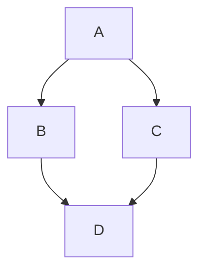

# Markdown

In addition to the standard [gfm](https://github.github.com/gfm) syntax, Doom includes some additional Markdown extension features.

## Callouts

Source code annotation component

::: note

1. Please use inline code comments according to the actual language, such as `;`, `%`, `#`, `//`, `/** */`, `--`, and `<!-- -->`, etc.
2. If you want to treat them as code comments, use `[\!code callout]` for escaping.
3. Sometimes, `:::callouts` may display abnormally due to nested indentation; you can use `<div class="doom-callouts">` or the `<Callouts>` component instead.

:::

````mdx
```sh
Memory overhead per virtual machine ≈ (1.002 × requested memory) \
              + 218 MiB \  # [\!code callout]
              + 8 MiB × (number of vCPUs) \  # [\!code callout]
              + 16 MiB × (number of graphics devices) \  # [\!code callout]
              + (additional memory overhead) # [\!code callout]
```

:::callouts

1. Required for the processes that run in the `virt-launcher` pod.
2. Number of virtual CPUs requested by the virtual machine.
3. Number of virtual graphics cards requested by the virtual machine.
4. Additional memory overhead:
   - If your environment includes a Single Root I/O Virtualization (SR-IOV) network device or a Graphics Processing Unit (GPU), allocate 1 GiB additional memory overhead for each device.
   - If Secure Encrypted Virtualization (SEV) is enabled, add 256 MiB.
   - If Trusted Platform Module (TPM) is enabled, add 53 MiB.

:::
````

```sh
Memory overhead per virtual machine ≈ (1.002 × requested memory) \
              + 218 MiB \  # [!code callout]
              + 8 MiB × (number of vCPUs) \  # [!code callout]
              + 16 MiB × (number of graphics devices) \  # [!code callout]
              + (additional memory overhead) # [!code callout]
```

:::callouts

1. Required for the processes that run in the `virt-launcher` pod.
2. Number of virtual CPUs requested by the virtual machine.
3. Number of virtual graphics cards requested by the virtual machine.
4. Additional memory overhead:
   - If your environment includes a Single Root I/O Virtualization (SR-IOV) network device or a Graphics Processing Unit (GPU), allocate 1 GiB additional memory overhead for each device.
   - If Secure Encrypted Virtualization (SEV) is enabled, add 256 MiB.
   - If Trusted Platform Module (TPM) is enabled, add 53 MiB.

:::

For more source code transformation features, please refer to [Shiki Transformers](https://shiki.style/packages/transformers#transformers).

## [Mermaid](https://mermaid.js.org)

Chart drawing tool

````mdx

````


With [Markdown Preview Mermaid](https://github.com/mjbvz/vscode-markdown-mermaid), you can preview in real-time in VSCode.
