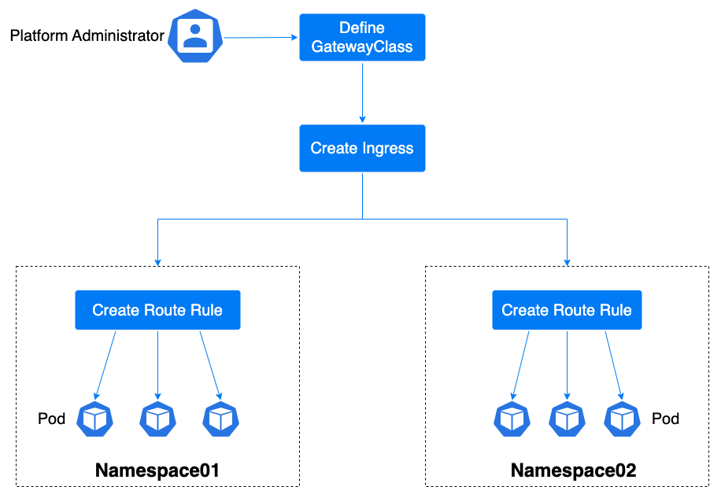

# In-Depth Understanding of Gateway

An inbound gateway (Gateway) is an instance deployed from the Gateway Class. It creates listeners to capture external traffic on specified domain names and ports. Together with routing rules, it can route the specified external traffic to the corresponding backend instances.

## Terminology

| Resource Name       | Overview                                                                                                                                                                                                                                                                                                                                                          | Usage Instructions                                                                |
| ------------------- | ----------------------------------------------------------------------------------------------------------------------------------------------------------------------------------------------------------------------------------------------------------------------------------------------------------------------------------------------------------------- | --------------------------------------------------------------------------------- |
| **Gateway Class**   | In the standard Gateway API documentation, the Gateway Class is defined as a template for creating gateways. Different templates can create inbound gateways for different business scenarios, facilitating rapid traffic management.                                                                                                                             | The platform includes dedicated Gateway Classes.                                  |
| **Inbound Gateway** | The inbound gateway corresponds to specific resource instances, and users can exclusively utilize all listening and computing resources of this inbound gateway. It is a configuration of routing rules effective for the listener. When external traffic is detected by the gateway, it will be distributed to backend instances according to the routing rules. | It can be viewed as a load balancer instance.                                     |
| **Route Rule**      | Route rules define a series of guidelines for traffic distribution from the gateway to services. The currently standard supported types of routing rules in the Gateway API include HTTPRoute, TCPRoute, UDPRoute, etc.                                                                                                                                           | The platform currently supports listening to HTTP, HTTPS, TCP, and UDP protocols. |

## Functional Background

Ingress resource objects do not adequately meet network demands, leading many scenarios where Ingress controllers require the definition of annotations or CRDs for functional expansion. This is highly detrimental to standardization and data migration.

The open-source project Gateway API, managed by the SIG-NETWORK community (previously known as Service API), aims to enhance service networking through a scalable, role-based interface. Gateway API is a collection of API resources in Kubernetes, including GatewayClass, Gateway, HTTPRoute, TCPRoute, Service, etc. These resources collectively build business models for various network scenarios.

## Usage Process

To utilize inbound gateway functionality, it must be used in conjunction with listeners and routing rules. The following is a general process example in typical scenarios:

1. Choose a Gateway Class.

2. Create an inbound gateway and set up listeners to monitor HTTP, HTTPS, TCP, and UDP protocol traffic from specified domain names.

3. Add routing rules, so that traffic detected by the gateway is forwarded to the specified backend instances according to the routing rules.

