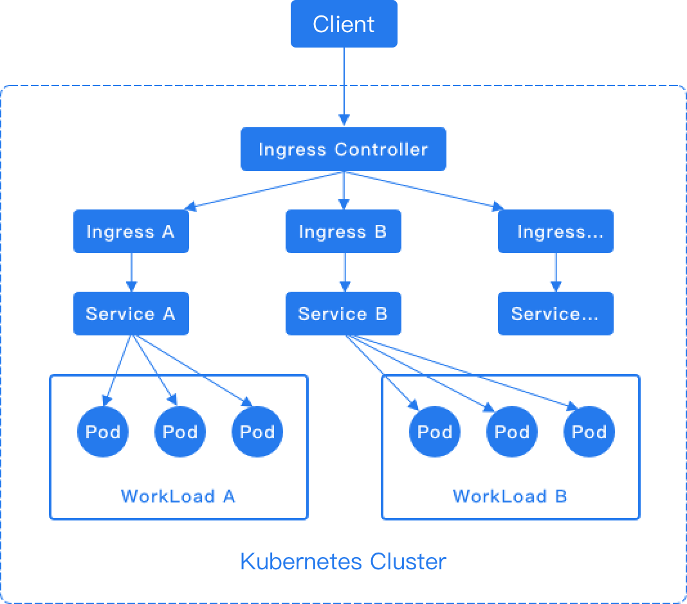

# Understanding Ingress in Depth

Ingress rules (Kubernetes Ingress) expose HTTP/HTTPS routes from outside the cluster to internal routing (Kubernetes Service), enabling control of external access to computing components.

## Implementation Method

Ingress rules depend on the implementation of the Ingress Controller, which is responsible for listening to changes in Ingress and Service. After a new Ingress rule is created, a forwarding rule matching the Ingress rule is automatically generated within the Ingress Controller. When the Ingress Controller receives a request, it matches the forwarding rule from the Ingress rule and distributes the traffic to the specified internal routes, as shown in the diagram below.

**Note**: For the HTTP protocol, Ingress only supports the 80 port as the external port. For the HTTPS protocol, Ingress only supports the 443 port as the external port. The platform's load balancer will automatically add the 80 and 443 listening ports.
